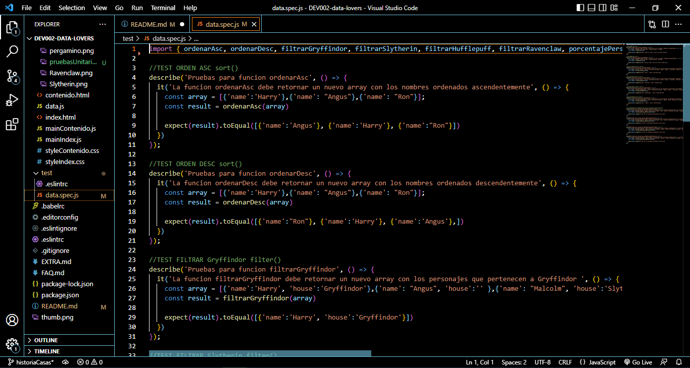

# El Mapa del Merodeador

## Índice

* [1. Preámbulo](#1-preámbulo)
* [2. Definición de Producto](#2-definición-de-producto)
* [3. Historias de usuario](#3-historias-de-usuario)
* [4. Diseño de la Interfaz de Usuario](#4-diseño-de-la-interfaz-de-usuario)

***

## 1. Preámbulo

Harry Potter es una serie de novelas fantásticas escrita por la autora británica J. K. Rowling, en la que se describen las aventuras del joven aprendiz de magia y hechicería Harry Potter y sus amigos Hermione Granger y Ron Weasley, durante los años que pasan en el Colegio Hogwarts de Magia y Hechicería. 

El Mapa del Merodeador es un curioso artículo mágico que muestra las aulas, pasillos, y la mayoria de espacios y rincones del castillo del Colegio Hogwarts(excepto la Sala de los Menesteres y la cámara Secreta). Además es capaz de identificar con precisión a cada persona, y no se deja engañar por animagos, pociones multijugos, o capas de invisibilidad. Incluso los fantasmas de Hogwarts no están exentos de esto. También puede revelar pasajes secretos usados por "Los Merodeadores".

## 2. Definición de Producto

En este proyecto **construirás una _página web_ para visualizar un
_conjunto (set) de datos_** que se adecúe a lo que descubras que tu usuario
necesita.

Como entregable final tendrás una página web que permita **visualizar la data,
filtrarla, ordenarla y hacer algún cálculo agregado**. Con cálculo agregado
nos referimos a distintos cálculos que puedes hacer con la data para mostrar
información aún más relevante para los usuarios (promedio, el valor máximo
o mínimo, etc).

Esta vez te proponemos una serie de datos de diferentes _temáticas_ para que
explores y decidas con qué temática te interesa trabajar. Hemos elegido
específicamente estos sets de datos porque creemos que se adecúan bien a esta
etapa de tu aprendizaje.

Una vez que definas tu área de interés, buscar entender quién es tu usuario
y qué necesita saber o ver exactamente; luego podrás construir la interfaz que
le ayude a interactuar y entender mejor esos datos.

## 3. Historias de usuario - HU

## 4. Diseño de la Interfaz de Usuario

#### Prototipo de baja fidelidad

Durante tu trabajo deberás haber hecho e iterado bocetos (_sketches_) de tu
solución usando papel y lápiz. Te recomendamos tomar fotos de todas las
iteraciones que hagas, que las subas a tu repositorio y las menciones en tu
`README.md`.

[Prototipo Baja Fidelidad](https://www.figma.com/file/jpt5p67fjWUPTB9l9twJeF/Untitled?node-id=0%3A1&t=qHBDVehVx1wSBOnf-3)

#### Prototipo de alta fidelidad

Lo siguiente es diseñar tu Interfaz de Usuario (UI por sus siglas en inglés -
_User Interface_). Para eso debes aprender a utilizar alguna herramienta de
diseño visual. Nosotros te recomendamos [Figma](https://www.figma.com/) que es
una herramienta que funciona en el navegador y, además, puedes crear una cuenta
gratis. Sin embargo, eres libre de utilizar otros editores gráficos como
Illustrator, Photoshop, PowerPoint, Keynote, etc.

El diseño debe representar el _ideal_ de tu solución. Digamos que es lo que
desearías implementar si tuvieras tiempo ilimitado para trabajar. Además, tu
diseño debe seguir los fundamentos de _visual design_.

[Prototipo Alta Fidelidad](https://www.figma.com/file/jpt5p67fjWUPTB9l9twJeF/Untitled?node-id=80%3A6&t=qHBDVehVx1wSBOnf-0)

[Prototipo Tarjetas](https://www.figma.com/file/jpt5p67fjWUPTB9l9twJeF/Untitled?node-id=189%3A10&t=qHBDVehVx1wSBOnf-3)

#### Testeos de usabilidad

Durante el reto deberás hacer _tests_ de usabilidad con distintos usuarios, y
en base a los resultados, deberás iterar tus diseños. Cuéntanos
qué problemas de usabilidad detectaste a través de los _tests_ y cómo los
mejoraste en tu propuesta final.

### Implementación de la Interfaz de Usuario (HTML/CSS/JS)

Luego de diseñar tu interfaz de usuario deberás trabajar en su implementación.
**No** es necesario que construyas la interfaz exactamente como la diseñaste.
Tu tiempo de hacking es escaso, así que deberás priorizar

Como mínimo, tu implementación debe:

1. Mostrar la data en una interfaz: puede ser un card, una tabla, una lista,
   etc.
2. Permitir al usuario interactuar para obtener la infomación que necesita.
3. Ser _responsive_, es decir, debe visualizarse sin problemas desde distintos
   tamaños de pantallas: móviles, tablets y desktops.
4. Que la interfaz siga los fundamentos de _visual design_.

### Pruebas unitarias
Pruebas Unitarias en el archivo  data.spec.js

