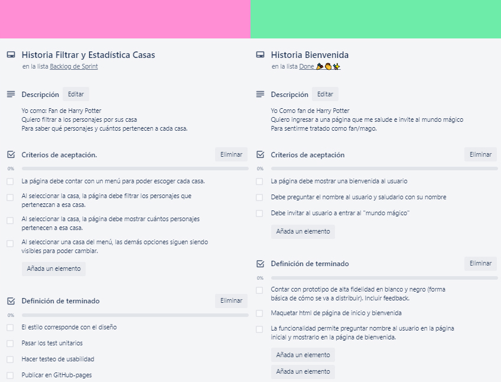

# El Mapa del Merodeador

## Índice

* [1. Preámbulo](#1-preámbulo)
* [2. Definición de Producto](#2-definición-de-producto)
* [3. Historias de usuario](#3-historias-de-usuario)
* [4. Diseño de la Interfaz de Usuario](#4-diseño-de-la-interfaz-de-usuario)

***

## 1. Preámbulo

Harry Potter es una serie de novelas fantásticas escrita por la autora británica J. K. Rowling, en la que se describen las aventuras del joven aprendiz de magia y hechicería Harry Potter y sus amigos Hermione Granger y Ron Weasley, durante los años que pasan en el Colegio Hogwarts de Magia y Hechicería. 

El Mapa del Merodeador es un curioso artículo mágico que, durante la saga, muestra las aulas, pasillos, y la mayoria de espacios y rincones del castillo del Colegio Hogwarts(excepto la Sala de los Menesteres y la cámara Secreta). Además es capaz de identificar con precisión a cada persona, y no se deja engañar por animagos, pociones multijugos, o capas de invisibilidad. Incluso los fantasmas de Hogwarts no están exentos de esto. También puede revelar pasajes secretos usados por "Los Merodeadores".

## 2. Definición de Producto

En este proyecto **construirás una _página web_ para visualizar un
_conjunto (set) de datos_** que se adecúe a lo que descubras que tu usuario
necesita.

Como entregable final tendrás una página web que permita **visualizar la data,
filtrarla, ordenarla y hacer algún cálculo agregado**. Con cálculo agregado
nos referimos a distintos cálculos que puedes hacer con la data para mostrar
información aún más relevante para los usuarios (promedio, el valor máximo
o mínimo, etc).

Esta vez te proponemos una serie de datos de diferentes _temáticas_ para que
explores y decidas con qué temática te interesa trabajar. Hemos elegido
específicamente estos sets de datos porque creemos que se adecúan bien a esta
etapa de tu aprendizaje.

Una vez que definas tu área de interés, buscar entender quién es tu usuario
y qué necesita saber o ver exactamente; luego podrás construir la interfaz que
le ayude a interactuar y entender mejor esos datos.

## 3. Historias de usuario - HU

Las historias de Usuario se desarrollaron en base a una pequeña investigación con fans de la saga

Se muestran los personajes de la Saga de Harry Potter

Las Tarjetas continen información relevante sobre los personajes como su nombre, fecha de nacimiento y muerte, su especie y los libros en los cuales aparece.

Se puede ordena los personajes según su nombre, en orden Ascendente y Descendente.

Permite filtrar los personajes según la Casa de Colegio a la que pertenecen: Gryffindor, Slytherin, Hufflepuff, Ravenclaw.

Se puede conocer el porcentaje de personajes que pertenecen a las casas del colegio Hogwarts.

## 4. Diseño de la Interfaz de Usuario

Los prototipos de alta y baja fidelidad nos permitieron recibir feedback de compañeras y posibles visitantes de la página.

#### Prototipo de baja fidelidad

[Prototipo Baja Fidelidad](https://www.figma.com/file/jpt5p67fjWUPTB9l9twJeF/Untitled?node-id=0%3A1&t=qHBDVehVx1wSBOnf-3)

#### Prototipo de alta fidelidad

[Prototipo Alta Fidelidad](https://www.figma.com/file/jpt5p67fjWUPTB9l9twJeF/Untitled?node-id=80%3A6&t=qHBDVehVx1wSBOnf-0)

[Prototipo Tarjetas](https://www.figma.com/file/jpt5p67fjWUPTB9l9twJeF/Untitled?node-id=189%3A10&t=qHBDVehVx1wSBOnf-3)

#### Testeos de usabilidad

Durante el reto deberás hacer _tests_ de usabilidad con distintos usuarios, y
en base a los resultados, deberás iterar tus diseños. Cuéntanos
qué problemas de usabilidad detectaste a través de los _tests_ y cómo los
mejoraste en tu propuesta final.

### Implementación de la Interfaz de Usuario (HTML/CSS/JS)

Luego de diseñar tu interfaz de usuario deberás trabajar en su implementación.
**No** es necesario que construyas la interfaz exactamente como la diseñaste.
Tu tiempo de hacking es escaso, así que deberás priorizar

Como mínimo, tu implementación debe:

1. Mostrar la data en una interfaz: puede ser un card, una tabla, una lista,
   etc.
2. Permitir al usuario interactuar para obtener la infomación que necesita.
3. Ser _responsive_, es decir, debe visualizarse sin problemas desde distintos
   tamaños de pantallas: móviles, tablets y desktops.
4. Que la interfaz siga los fundamentos de _visual design_.

### Pruebas unitarias
Pruebas Unitarias en el archivo  data.spec.js

